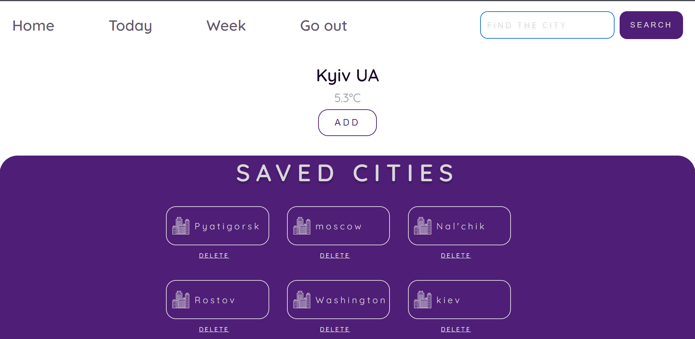
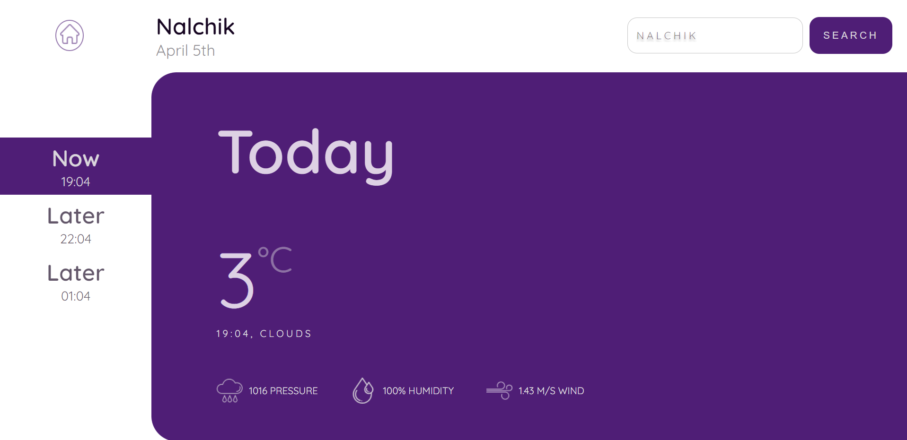

# Weather Application

This application can display the weather forecast in the selected city for one day or for a whole week. We can also save cities in our personal profile

### Start page

### Today page

## Backend

I wrote a backend for this application. You can find it [here](https://github.com/ToxichQQQ/weather-application-api)

## Stack Technologies

- React
- Material UI
- Moment JS
- Formik
- Yup
- React-Router

## Testing

To test the weather application, you need to enter the following commands:

You need to clone the repository using the command:

git clone git@github.com:ToxichQQQ/weather-application.git

After the repository has been copied, go to the repository and run the npm install command.

Start the client using the npm start

## Thanks for your attention

You can contact me by this email storozhenko.dev@gmail.com
